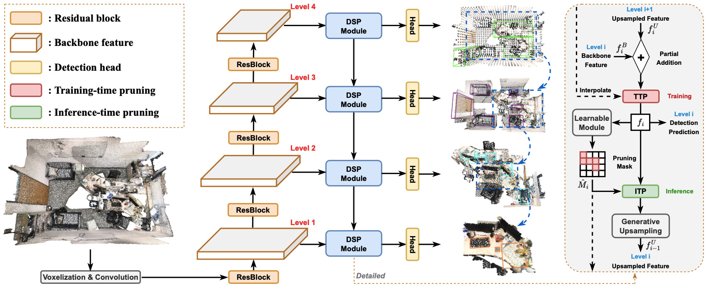
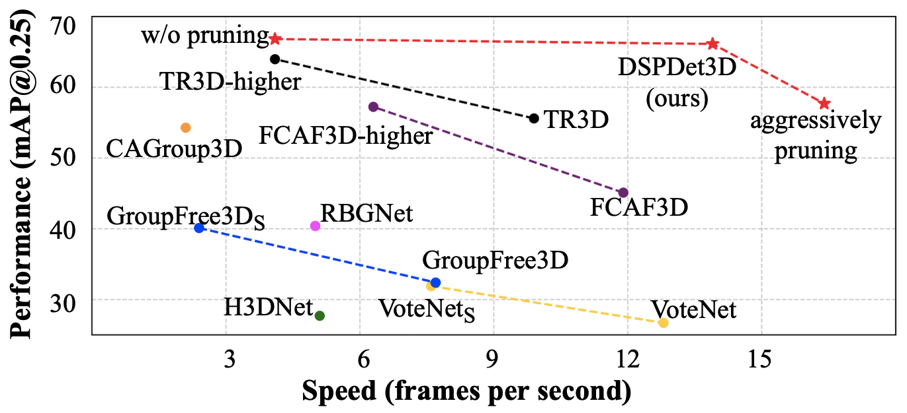

# 3D Small Object Detection with Dynamic Spatial Pruning

## Introduction

This repo contains PyTorch implementation for paper [3D Small Object Detection with Dynamic Spatial Pruning](https://arxiv.org/abs/2305.03716) based on [MMDetection3D](https://github.com/open-mmlab/mmdetection3d).

> 3D Small Object Detection with Dynamic Spatial Pruning  
> [Xiuwei Xu](https://xuxw98.github.io/)*, Zhihao Sun\*, [Ziwei Wang](https://ziweiwangthu.github.io/), Hongmin Liu, [Jie Zhou](https://scholar.google.com/citations?user=6a79aPwAAAAJ&hl=en&authuser=1), [Jiwen Lu](http://ivg.au.tsinghua.edu.cn/Jiwen_Lu/)
>


## News
- [2024/7/01]: DSPDet3D is accepted to ECCV 2024!
- [2023/6/04]: We transfer DSPDet3D to extremely large scenes and show great performance! Demo will be released in our [project page](https://xuxw98.github.io/DSPDet3D/).
- [2023/5/01]: Code release.

## Method
Overall pipeline of DSPDet3D:




## Getting Started
For data preparation and environment setup:
- [Installation](docs/install.md) 
- [Prepare Dataset](docs/data.md)

For training and evaluation:
- [Train and Eval](docs/run.md)


## Demo
The demo code will download weights and an example scene first and then visualize prediction results.

| Dataset  | Scannet                  | Matterport3D                  |
|:--------:|:------------------------:|:-------------------------:|
| Command  | `python -m demo.scannet` | `python -m demo.mp3d` |
| Result   |     |     |


## Main Results
We provide the checkpoints for quick reproduction of the results reported in the paper. The pruning threshold can be adjusted freely to tradeoff between accuracy and efficiency without any finetuning.
 Benchmark | mAP@0.25 | mAP@0.5 | Downloads |
 :----: | :----: | :----: | :----: |
 [ScanNet-md40](https://github.com/wyf-ACCEPT/BackToReality) | 65.25 | 53.66 | [model](https://cloud.tsinghua.edu.cn/f/bd49db94cb7548beba63/?dl=1)
 [TO-SCENE-down](https://github.com/GAP-LAB-CUHK-SZ/TO-Scene) | 63.67 | 55.71 | [model](https://cloud.tsinghua.edu.cn/f/0e425d5d053b46c18b73/?dl=1)

Comparison with state-of-the-art methods on TO-SCENE dataset:

<p align="left"></p>

Visualization results on ScanNet:


Visualization results on Matterport3D:


## Acknowledgement
We thank a lot for the flexible codebase of [FCAF3D](https://github.com/SamsungLabs/fcaf3d) and valuable datasets provided by [ScanNet](https://github.com/ScanNet/ScanNet) and [TO-SCENE](https://github.com/GAP-LAB-CUHK-SZ/TO-Scene).


## Bibtex
If this work is helpful for your research, please consider citing the following BibTeX entry.

```
@article{xu2023dsp, 
      title={3D Small Object Detection with Dynamic Spatial Pruning}, 
      author={Xiuwei Xu and Zhihao Sun and Ziwei Wang and Hongmin Liu and Jie Zhou and Jiwen Lu},
      journal={arXiv preprint arXiv:2305.03716},
      year={2023}
}
```
